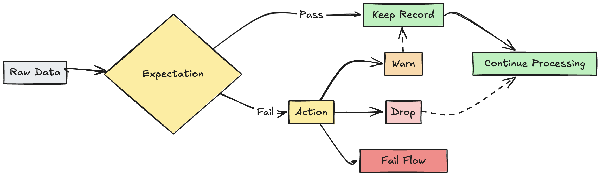

# Databricks-Declarative-Pipelines
Implementation of Medallion Architecture (Bronze, Silver, Gold layers) using Databricks, PySpark, and Delta Lake for scalable data engineering pipelines.You just declare what you want – and DLT takes care of how it should be done.

So, what is Databricks-Declarative-Pipelines means:
You describe what data transformation you want, and Databricks automatically handles how the pipeline runs.

It is the modern pipeline approach behind DLT (Delta Live Tables).

# what is DLT(Delta Live Tables)???
It is a framework used to build, automate, and manage data pipelines easily in Databricks.

Simple Meaning

Instead of writing complex ETL pipelines manually, DLT helps you:
Ingest data,
Clean and transform data,
Create tables automatically,
Monitor pipeline quality,
Handle errors and dependencies and 
with much less code.

Real-World Example

Suppose a company receives raw sales data every day.

Using DLT:

Raw data comes into a Bronze table           
Cleaned data goes to a Silver table                     
Final analytics-ready data goes to a Gold table     

This follows the Medallion Architecture in Databricks.
Medallion Architecture is a recommended data design pattern used in the Lakehouse architecture to organize data into multiple layers based on quality and processing stage.

It mainly consists of:

Bronze Layer → Raw data                  
Silver Layer → Cleaned and transformed data                   
Gold Layer → Business-ready data              

This architecture helps build scalable and reliable data pipelines using technologies like:

Delta Lake                 
Apache Spark                         
Databricks Delta Live Tables (DLT)

#Architecture Flow

Data Sources             
     ↓                         
 Bronze Layer           
     ↓                          
 Silver Layer                 
     ↓                      
 Gold Layer              
     ↓                      
BI / ML / Analytics         

# BENEFITS

Built-in DLT supports something called Expectations – where you can define rules (like "this column should never be null"). If a record breaks the rule, DLT will drop it or send it to quarantine – and you don’t have to write extra code to handle it. Data Quality Check.

### AUTOMATIC DEPENDENCY MANAGEMENT                 
You don’t need to worry about the order of transformations. Just define your tables and DLT figures out which table depends on which and runs things in the correct order.

### INCREMENTAL PROCESSING
DLT is smart – it only processes new or changed data using something called Change Data Capture (CDC).

### UNIFIED BATCH AND STREAMING
Normally, batch and streaming pipelines are built and maintained separately. But with DLT, you can use the same code for both. It detects whether your data source is streaming and handles it accordingly.  

# Lakeflow code editor in Databricks

Lakeflow Code Editor in Databricks is the coding environment used to write and manage data pipelines using code instead of only visual tools.

It is mainly used for creating:                

ETL pipelines                       
Streaming pipelines                                        
Batch workflows                               
Declarative Pipelines (DLT)                                    

      

